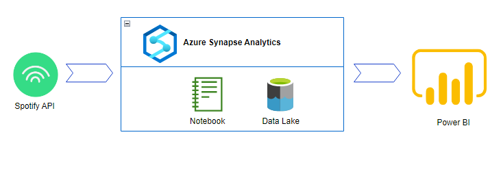

# BI Solution using Azure synapse and Power BI

Spotify is a digital music, podcast, and video service that gives you access to millions of songs and other content from creators all over the world.

In this project,I used Azure Synapse Anlytics service for data ingestion,data transformation and data reporting task.Data ingestion and data transformation were done through synapse notebook insted of azure synapse pipeline.Data extraction have done in following order.

 - Extract track features
 - Artist features using artist ID
 - Audio features using track ID

Next step is to store the extrscted data into the azure data lake.Then later it can be used for different analytics scenarios.Once it ready,Power BI can be connect to the data lake data container.It can be done through azure synapse analytics or Power BI desktop.To do through synapse you should have power BI serveice account.If not you can continue reporting part through power BI desktop.

  

For the reporting part I used only audio features.It will present the how audio features are vary with different artist and genres.

  

